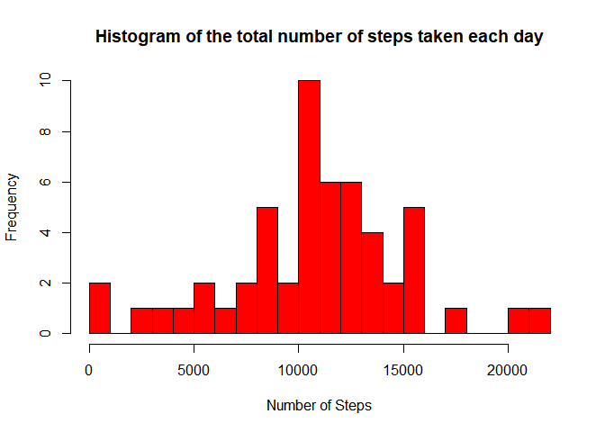
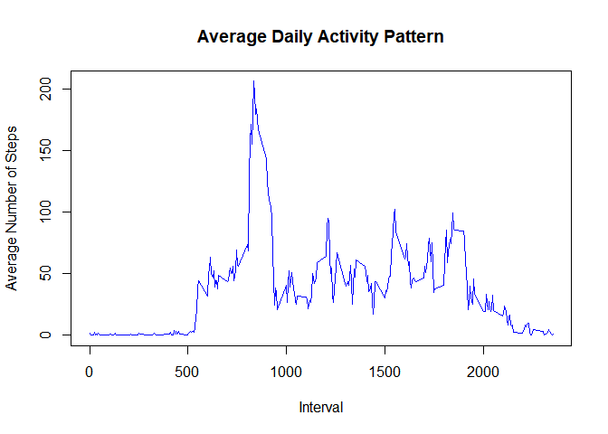
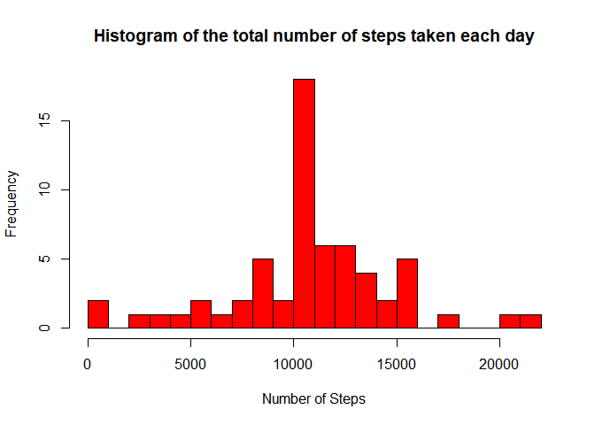
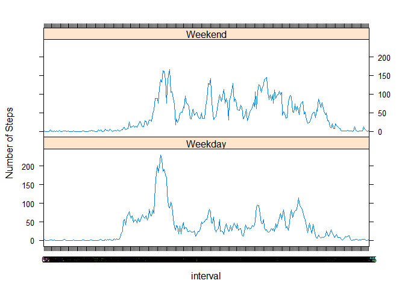

## Loading and preprocessing the data

```r
data <- read.csv("activity.csv", header = TRUE, sep = ",", na.strings = "NA")
library(dplyr)
library(ggplot2)
```

```r
data$date <- as.Date(data$date, format = "%Y-%m-%d")
data$interval <- factor(data$interval)

NA_index <- is.na(as.character(data$steps))
data_no_NA <- data[!NA_index,]
head(data_no_NA)
```

```
##     steps       date interval
## 289     0 2012-10-02        0
## 290     0 2012-10-02        5
## 291     0 2012-10-02       10
## 292     0 2012-10-02       15
## 293     0 2012-10-02       20
## 294     0 2012-10-02       25
```

## What is mean total number of steps taken per day?

```r
steps_each_day <- aggregate(steps ~ date, data = data_no_NA, sum)
#Adding column names to the created data frame
colnames(steps_each_day) <- c("date", "steps")

hist(as.numeric(steps_each_day$steps), breaks = 20, col = "red", xlab = "Number of Steps", main= "Histogram of the total number of steps taken each day")
```

<!-- -->

```r
mean(steps_each_day$steps)
```

```
## [1] 10766.19
```


## What is the average daily activity pattern?

```r
steps_per_interval <- aggregate(data_no_NA$steps, by=list(interval=data_no_NA$interval), FUN=mean)

#Adding columns names
colnames(steps_per_interval) <- c("interval", "average_steps")

#plotting the average daily activity pattern 
plot(as.integer(levels(steps_per_interval$interval)), steps_per_interval$average_steps, type="l",
     xlab = "Interval", ylab = "Average Number of Steps", main = "Average Daily Activity Pattern",  col ="blue")
```

<!-- -->


## Imputing missing values

```r
NA_index <- which(is.na(as.character(data$steps)))
complete_data <- data
#Imputing missing values using the mean for that 5-minute interval
complete_data[NA_index, ]$steps<-unlist(lapply(NA_index, FUN=function(NA_index){
  steps_per_interval[data[NA_index,]$interval==steps_per_interval$interval,]$average_steps
}))
```


## Are there differences in activity patterns between weekdays and weekends?

```r
#Creating a data frame with the steps taken for each day
steps_each_day_complete <- aggregate(steps ~ date, data = complete_data, sum)
#Adding column names to the created data frame
colnames(steps_each_day_complete) <- c("date", "steps")

#Making the histogram
hist(as.numeric(steps_each_day_complete$steps), breaks = 20, col = "red", xlab = "Number of Steps", main= "Histogram of the total number of steps taken each day")
```

<!-- -->

```r
mean(steps_each_day_complete$steps)
```

```
## [1] 10766.19
```

```r
median(steps_each_day_complete$steps)
```

```
## [1] 10766.19
```

```r
#Creating a factor variable "day "to store the day of the week:
complete_data$day <- as.factor(weekdays(complete_data$date))

#Creating a logical variable "is_weekday" (weekday=TRUE, weekend = FALE) :
complete_data$is_weekday <- ifelse(!(complete_data$day %in% c("Saturday","Sunday")), TRUE, FALSE) 


#Calculating the average number of steps for weekdays
weekdays_data <- complete_data[complete_data$is_weekday,]
steps_per_interval_weekdays <- aggregate(weekdays_data$steps, by=list(interval=weekdays_data$interval), FUN=mean)


#Calculating the average number of steps for weekends
weekends_data <- complete_data[!complete_data$is_weekday,]
steps_per_interval_weekends <- aggregate(weekends_data$steps, by=list(interval=weekends_data$interval), FUN=mean)

#Adding columns names
colnames(steps_per_interval_weekdays) <- c("interval", "average_steps")
colnames(steps_per_interval_weekends) <- c("interval", "average_steps")
#Adding a column to indicate the day
steps_per_interval_weekdays$day <- "Weekday"
steps_per_interval_weekends$day <- "Weekend"

#Merging the two together
week_data <- rbind(steps_per_interval_weekends, steps_per_interval_weekdays)
#Converting the day variable to a factor
week_data$day <- as.factor(week_data$day)

#Making the plot
library(lattice)
xyplot(average_steps ~  interval | day, data = week_data, layout = c(1,2), type ="l", ylab="Number of Steps")
```

<!-- -->
